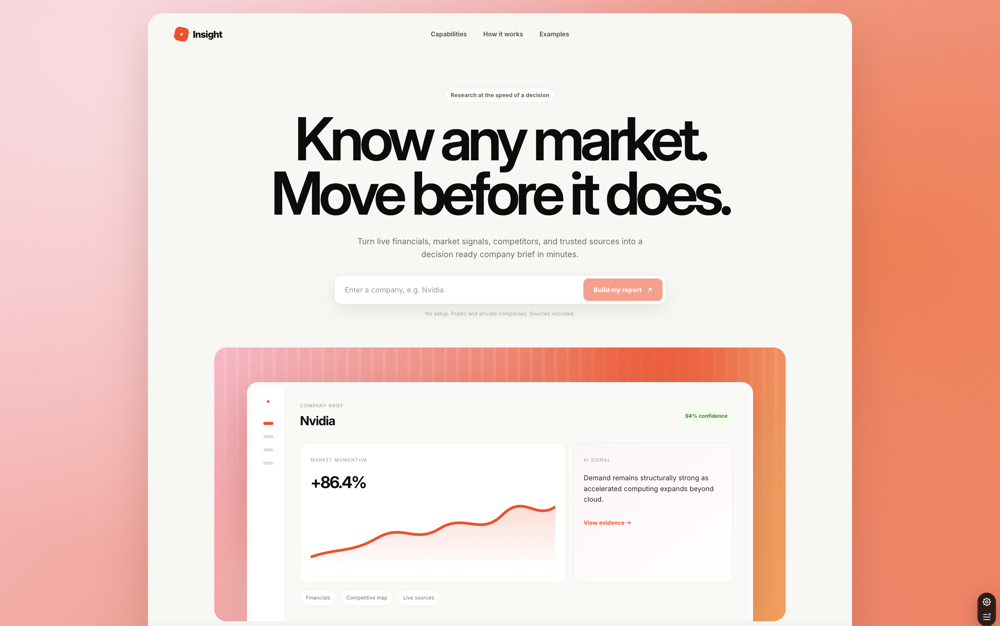
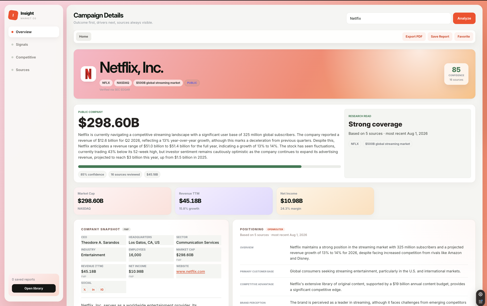

# Insight - AI-Powered Market Research Tool

Insight is a full-stack market research app that turns a company name into a structured, source-grounded research brief. It combines live web search, financial market data, public filings, social sentiment signals, and an LLM-generated analysis into one interactive dashboard.

The app supports both public companies and private startups. Public companies receive financial metrics, stock history, analyst sentiment, earnings data, and SEC event context. Private companies receive startup-focused sections such as funding, investors, growth signals, milestones, and market traction.

## Project Preview





## Features

- **AI-generated company briefs** with summary, market size, positioning, SWOT, competitors, confidence score, and cited sources.
- **Public/private company detection** that switches the report structure based on available market data.
- **Public market data** including ticker, exchange, sector, revenue, market cap, ratios, earnings, annual financials, stock history, and analyst sentiment.
- **Startup research view** for funding rounds, investor backing, hiring signals, milestones, customers, partnerships, and traction.
- **Source-grounded retrieval** using Tavily search results and trusted business, finance, market, and startup domains.
- **Competitor enrichment** with ticker, logo, market cap, revenue, industry, and overlapping products when available.
- **News and media signals** from Tavily, Yahoo Finance news, StockTwits, Hacker News, Reddit, and source registries.
- **Research Library** with saved reports, favorites, and search history persisted in browser local storage.
- **Interactive frontend dashboard** built with React, Vite, and Recharts.
- **PDF export** through the browser print flow.
- **Rate-limited FastAPI backend** with CORS configuration for local and deployed frontends.

## Tech Stack

| Layer | Tools |
|---|---|
| Frontend | React, Vite, Recharts, CSS |
| Backend | FastAPI, Pydantic, Uvicorn, SlowAPI |
| AI | OpenRouter through the OpenAI-compatible API |
| Search/RAG | Tavily |
| Market Data | yfinance, Yahoo Finance endpoints, SEC EDGAR, optional Financial Modeling Prep |
| Deployment Ready | Vercel frontend config, FastAPI backend |

## Project Structure

```text
.
├── backend/
│   ├── app/
│   │   ├── main.py          # FastAPI app and routes
│   │   ├── pipeline.py      # AI analysis pipeline
│   │   ├── schemas.py       # API request/response models
│   │   ├── market_data.py   # Financial data, tickers, ratios, history
│   │   ├── search.py        # Tavily search and source formatting
│   │   ├── edgar.py         # SEC EDGAR company/event helpers
│   │   ├── social.py        # StockTwits sentiment helpers
│   │   └── media.py         # Media/public-opinion helpers
│   ├── requirements.txt
│   ├── .env.example
│   └── test_openrouter.py
├── frontend/
│   ├── src/
│   │   ├── App.jsx
│   │   ├── App.css
│   │   └── main.jsx
│   ├── package.json
│   ├── vite.config.js
│   └── vercel.json
├── PRD.md
└── README.md
```

## Prerequisites

- Python 3.10+
- Node.js 18+
- npm
- OpenRouter API key
- Tavily API key

Optional:

- Financial Modeling Prep API key for additional company profile data.

## Environment Variables

Create `backend/.env` from the example file:

```bash
cd backend
cp .env.example .env
```

Required backend variables:

```env
OPENROUTER_API_KEY=your_openrouter_api_key
OPENROUTER_MODEL=openai/gpt-4o-mini
TAVILY_API_KEY=your_tavily_api_key
```

Optional backend variables:

```env
FMP_API_KEY=your_financial_modeling_prep_key
FRONTEND_URL=https://your-frontend-domain.com
```

Optional frontend variable:

```env
VITE_BACKEND_URL=http://localhost:8000
```

If `VITE_BACKEND_URL` is not set, the frontend defaults to `http://localhost:8000`.

## Local Development

### 1. Start the backend

```bash
cd backend
python -m venv .venv
source .venv/bin/activate
pip install -r requirements.txt
cp .env.example .env
```

Add your API keys to `backend/.env`, then run:

```bash
uvicorn app.main:app --reload
```

Backend runs at:

```text
http://localhost:8000
```

API docs:

```text
http://localhost:8000/docs
```

### 2. Start the frontend

In a second terminal:

```bash
cd frontend
npm install
npm run dev
```

Frontend runs at:

```text
http://localhost:5173
```

## API Endpoints

| Method | Endpoint | Description |
|---|---|---|
| `GET` | `/health` | Health check |
| `POST` | `/analyze` | Generate a full market research report for a company |
| `GET` | `/companies?q=` | Search company suggestions/autocomplete |
| `GET` | `/stock/{ticker}?period=1y` | Fetch stock history |
| `GET` | `/news/{company}?ticker=` | Fetch recent company news |
| `GET` | `/social/{ticker}` | Fetch StockTwits social sentiment |
| `GET` | `/media/{company}` | Fetch media and public-opinion overview |
| `GET` | `/preview?url=` | Fetch Open Graph preview data for a source URL |
| `GET` | `/debug/market?company=` | Debug raw market-data lookup |

Example `/analyze` request:

```bash
curl -X POST http://localhost:8000/analyze \
  -H "Content-Type: application/json" \
  -d '{"company":"Apple"}'
```

## Useful Commands

Backend:

```bash
cd backend
uvicorn app.main:app --reload
python -m app.pipeline "Stripe"
python test_openrouter.py
```

Frontend:

```bash
cd frontend
npm run dev
npm run build
npm run preview
npm run lint
```

## How It Works

1. The user enters a company name in the React frontend.
2. The frontend calls the FastAPI `/analyze` endpoint.
3. The backend fetches market data and determines whether the company is public, private, or unknown.
4. The pipeline retrieves current source material using Tavily and trusted domains.
5. Public-company reports are enriched with market data, stock history, analyst sentiment, earnings, and SEC filing context.
6. Private-company reports focus on funding, growth, traction, milestones, and investor signals.
7. OpenRouter generates a structured response using function/tool calling.
8. The backend validates the response with Pydantic and returns it to the dashboard.

## Deployment Notes

The frontend includes a `vercel.json` rewrite configuration for client-side routing on Vercel.

For deployment:

- Deploy `frontend/` to Vercel or another static frontend host.
- Deploy `backend/` to a Python-friendly host such as Render, Fly.io, Railway, or an API server.
- Set `VITE_BACKEND_URL` in the frontend deployment to the backend URL.
- Set `FRONTEND_URL` in the backend deployment so CORS allows the deployed frontend.
- Add the backend API keys as environment variables on the backend host.

## Notes

- API responses depend on upstream providers, so missing or rate-limited data may reduce report completeness.
- The project is designed for research assistance, not financial advice.
- The browser stores saved reports, favorites, and history locally; there is no user account system or database in the current version.

## License

No license file is currently included. Add one before publishing if you want to define how others can use this project.

## Product Demo

[▶ Watch the full Insight product demo](./Insight%20Video.mp4)
